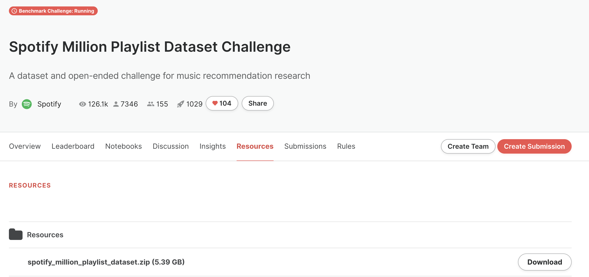

# A Scalable Framework for Automatic Playlist Continuation on Music Streaming Services


This repository provides our Python code to reproduce experiments from the paper **A Scalable Framework for Automatic Playlist Continuation on Music Streaming Services**, accepted for publication in the proceedings of the 46th International ACM SIGIR Conference on Research and Development in Information Retrieval ([SIGIR 2023](https://sigir.org/sigir2023/)).


## Automatic Playlist Continuation at Scale


Music streaming services often aim to recommend songs for users to extend the playlists they have created on these services. However, extending playlists while preserving their musical characteristics and matching user preferences remains a challenging task, commonly referred to as **Automatic Playlist Continuation (APC)**. Besides, while these services often need to select the best songs to recommend in real-time and among large catalogs with millions of candidates, recent research on APC mainly focused on models with few scalability guarantees and evaluated on relatively small datasets.

In this SIGIR 2023 paper, we introduce **a general framework to build scalable yet effective APC models** for large-scale applications. Based on a **Represent-Then-Aggregate** strategy, it ensures scalability by design while remaining flexible enough to incorporate a wide range of representation learning and sequence modeling techniques, e.g., based on recurrent neural networks or Transformers.

In the paper, we demonstrate the relevance of our framework through an in-depth experimental validation:
* Firstly, we provide **offline experiments** on Spotify's **Million Playlist Dataset (MPD)**, i.e., the largest public dataset for APC. This repository aims to facilitate the reproducibility of these experiments.
* In addition, we also explain how, in 2022, we successfully leveraged this framework to improve APC in production on the global music streaming service [Deezer](https://www.deezer.com/). We report results from a large-scale **online A/B test** on this service, emphasizing the practical impact of our approach in such a real-world application.

<p align="center">
  
</p>


## Installation

### Code

```
git clone https://github.com/deezer/APC-RTA
cd APC-RTA
pip install -r requirements.txt
```

Requirements: implicit==0.6.1, matplotlib==3.6.2, pandas==1.5.2, psutil==5.9.4, pympler==1.0.1, scipy==1.7.3, seaborn==0.12.1, tables==3.7.0, tqdm==4.64.1.

### Data

Please download Spotify's Million Playlist Dataset (MPD) on [AIcrowd.com](https://www.aicrowd.com/challenges/spotify-million-playlist-dataset-challenge).

You would need to create an account and register to the challenge to do so.

<p align="center">
  
</p>

Then, please unzip all files in a single folder, for instance: `resources/data/raw_MPD`.

Run the following script to pre-process and format the MPD (expected time: around 1 hour on a regular laptop).

```
python src/format_rta_input --mpd_path PATH/TO/UNZIPPED/MPD
```


## Run Experiments

### Train RTA models

Train the **MF-Transformer** model from the paper:

```
python -m src.main --model_name MF-Transformer
```

Notes:
* To train another model, replace `MF-Transformer` in the above command by the desired model name, as referred to in the paper.
* The complete list of parameters for each model is available in `resources/params/best_params_rta.json`.
* Training can be interrupted at any time. An intermediary model is saved at every epoch.

### Evaluate RTA models

Compute the **NDCG** score for the **MF-Transformer** model:
```
python -m src.plot_results --metric ndcg --models MF-Transformer
```

Notes:
* To evaluate another model, replace `MF-Transformer` in the above command by the desired model name, as referred to in the paper. You can plot results for several models on the same figure by separating their names with commas.
* To compute another score, replace `ndcg` in the above command by the desired score name, as referred to in the paper.


### Train and evaluate baselines

Format the MPD to comply with baseline models:

```
python -m src.format_baseline_input --mpd_path /PATH/TO/UNZIPPED/MPD
```

Train the **VSKNN** model from the paper:

```
python -m run_baselines --model_name VSKNN
```

After training, baseline models can be evaluated using the same script as for RTA models (see the above command for `src.plot_results`).
The above notes on model/score names and changes remain valid.


## Cite

Please cite our paper if you use this code in your own work:

```BibTeX
@inproceedings{bendada2023scalable,
 title = {A Scalable Framework for Automatic Playlist Continuation on Music Streaming Services},
 author = {Bendada, Walid and Salha-Galvan, Guillaume and Bouab\c{c}a, Thomas and Cazenave, Tristan},
 booktitle = {Proceedings of the 46th International ACM SIGIR Conference on Research and Development in Information Retrieval},
 year = {2023}
}
```
